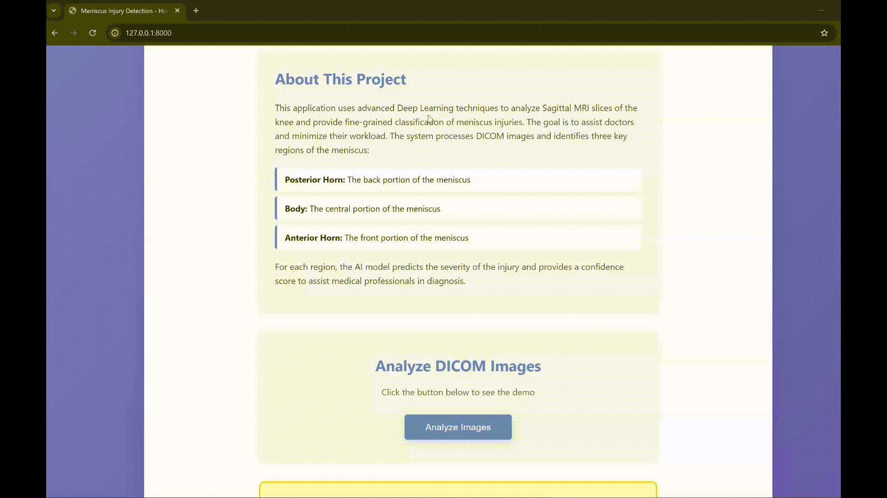
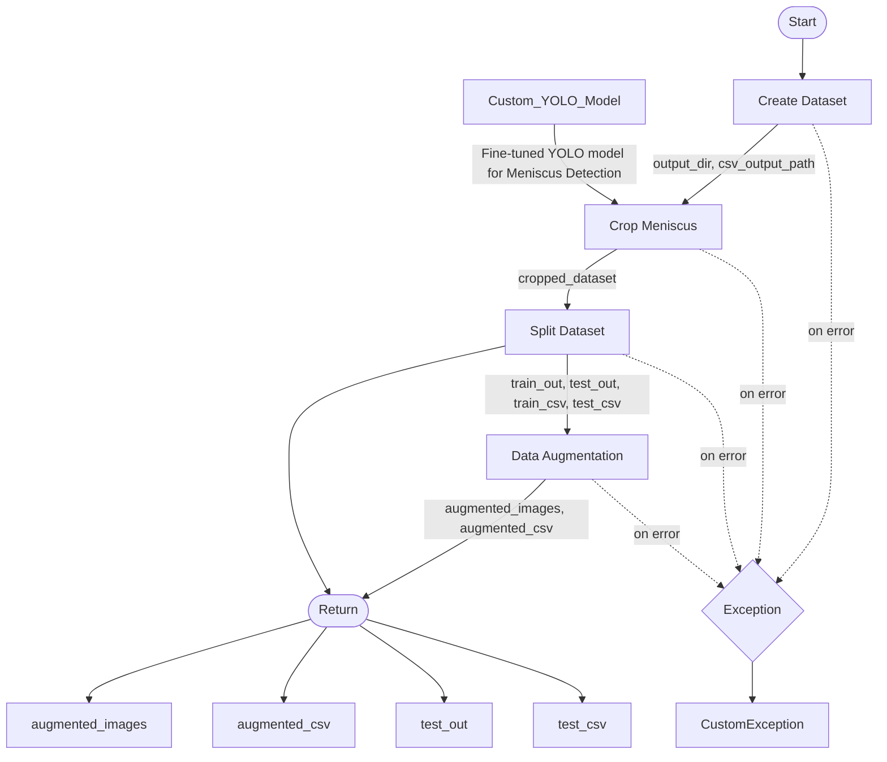
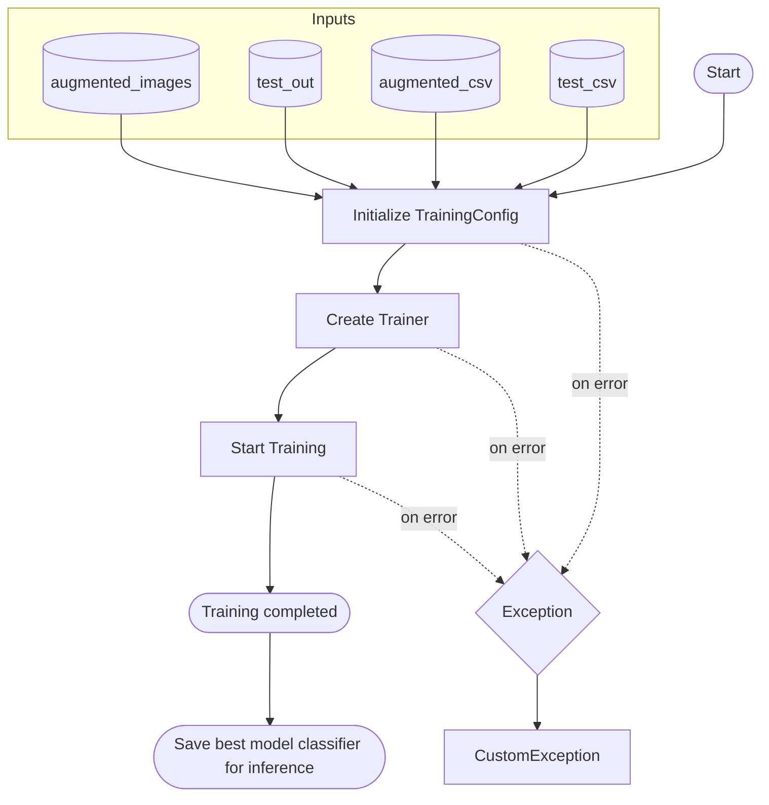
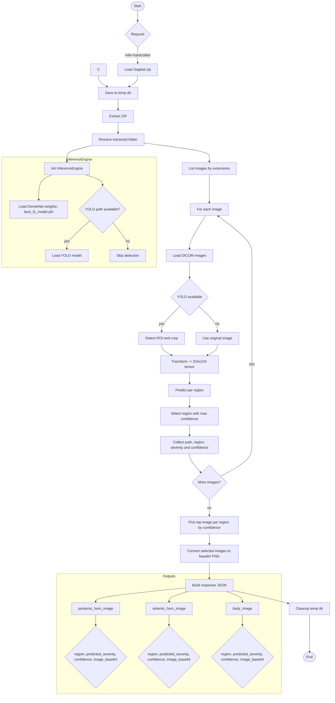

# AI-based Sagittal MRI Fine Grading of Meniscus Injury

This application uses deep learning to analyze sagittal MRI slices of the knee and provide fine-grained classification of meniscus injuries to assist clinicians and reduce workload. The system processes DICOM images and identifies three anatomical regions of the meniscus:

- **Posterior horn:** the back portion of the meniscus
- **Body:** the central portion of the meniscus
- **Anterior horn:** the front portion of the meniscus

For each region, the AI model predicts injury severity and provides a confidence score to aid clinical diagnosis.
This project provides an end-to-end solution for preprocessing, training, and inference for fine grading of meniscus injury using sagittal MRI scans. It exposes a FastAPI service for training and inference, and organizes code and artifacts to follow repeatable MLOps practices.

## Demo Video

## Live Demo
The application is hosted here:

- Live Space: [AI-based Sagittal MRI Fine Grading of Meniscus Injury](https://huggingface.co/spaces/ataa599/AI-based-Sagittal-MRI-Fine-Grading-of-Meniscus-Injury)

Note: This is a computationally intensive pipeline (YOLO ROI detection + DenseNet classification on DICOMs). On CPU-only hardware (no GPUs available on the hosted space), a single end-to-end run may take approximately 15–20 minutes to execute. Please be patient while the inference completes.

## Architecture
- FastAPI app (`app.py`) serving web UI and APIs
- Preprocessing pipeline (`pipelines/preprocess_pipeline.py`) to create, crop, split, and augment data
- Training pipeline (`pipelines/training_pipeline.py`) to train models
- Inference pipeline (`src/inference_pipeline/inference.py`) for predictions
- Deep learning modules (`src/deep_learning_architecture/`) including model, trainer, and config
- Artifacts folder structure for datasets, splits, and training results
- Logging and exception handling (`src/logging_and_exception/`)

## Pipelines
1. Preprocess

2. Training

3. Inferencing

## MLOps Practices
- Versioned Artifacts: Output data and models stored under `Artifacts/` with clear subfolders (dataset, splits, results)
- Reproducible Pipelines: Deterministic preprocessing steps encapsulated in configs (`*Config` dataclasses) and pipeline classes
- Configuration Management: Central config modules (`src/.../training_utils/config.py`) and pipeline configs
- Logging & Exceptions: Uniform logging and `CustomException` for robust error handling
- Environment Management: `requirements.txt` and optional `venv` for consistent environments
- Containerization: `Dockerfile` for reproducible builds and deployment
- Notebooks to Production: `notebooks/testing.ipynb` for exploration, pipelines for production-ready flow
- Separation of Concerns: Clear module boundaries (preprocess, training, inference, web)

## Data & Artifacts
- `Artifacts/augmented_dataset/`: augmented images and metadata
- `Artifacts/split_dataset/`: train/test splits and CSVs
- `Artifacts/Training_Results/`: models (`best_acc_model.pth`, `best_f1_model.pth`) and logs

## Folder Guide
- `app.py`: FastAPI server and endpoints
- `pipelines/`: Preprocess and training orchestration
- `src/`: Modules for data processing, models, training, logging, inference
- `static/`, `templates/`: Frontend assets for the web UI
- `notebooks/`: Experiments and sanity checks
